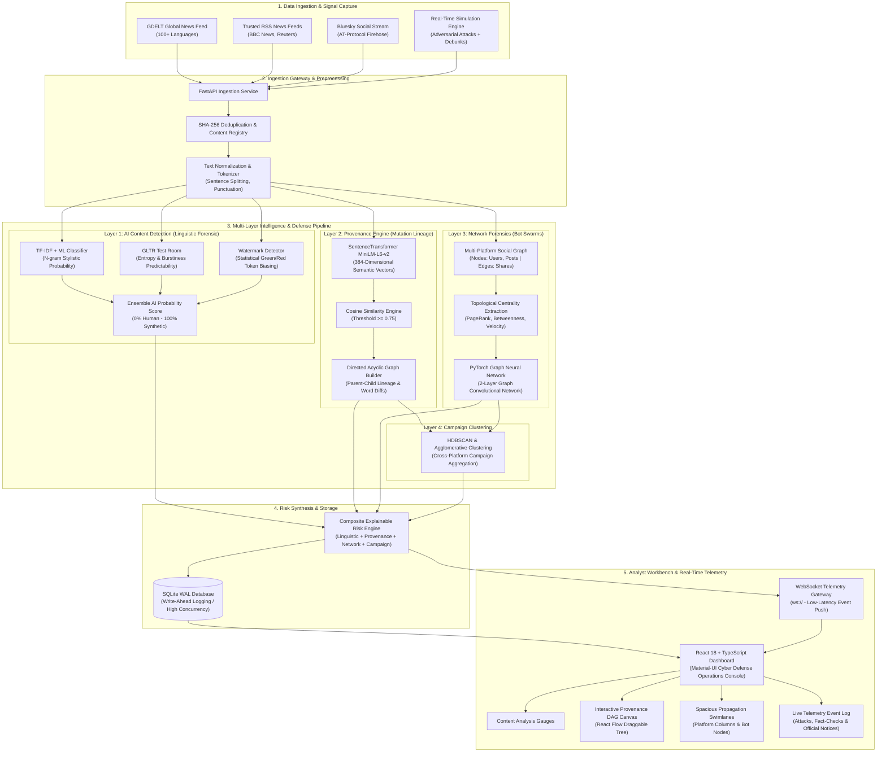
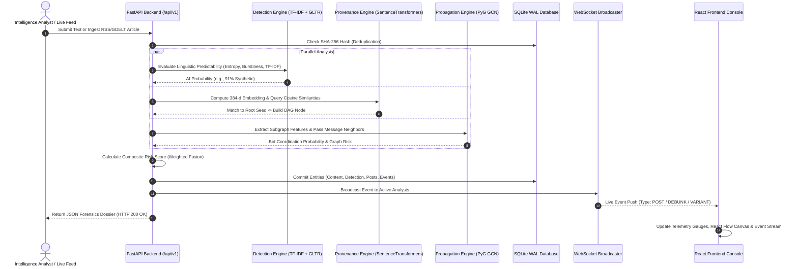

# 05. System Workflow & Architecture Diagrams (Mermaid)

> **Summary:** This document provides clear, visual Mermaid workflow diagrams for **AIShield**. You can render these in any Markdown viewer (GitHub, VS Code, Obsidian) or copy the Mermaid code directly into presentations.

---

## 1. Complete End-to-End System Workflow

This diagram illustrates how raw information flows from external sources through our multi-layer detection and forensic engines to the analyst dashboard.



---

## 2. Request Lifecycle Sequence (Step-by-Step Flow)

This sequence diagram illustrates exactly what happens when an analyst submits a post or when an article is ingested from the live web.



---

## 3. Propagation & Defense Dynamics (Simulation Workflow)

This diagram shows how our simulator generates a realistic mixed ecosystem containing both adversarial attacks and defensive counter-measures.

```mermaid
stateDiagram-v2
    [*] --> Idle: Simulator Standby

    state "Scenario Selection" as Select {
        DisinfoThreat: "🚨 Disinfo Threat (Operation GridPulse)"
        VerifiedScience: "🛡️ Verified Science (NASA JWST Outreach)"
    }

    Idle --> Select: Analyst Chooses Scenario

    state "Live Simulation Stream (WebSockets)" as SimStream {
        state DisinfoThreat {
            direction TB
            BotLeak: "60% Adversarial Bot Propagation (Risk: 74% - 98%)"
            FactCheck: "25% Fact-Check Debunks (Risk: 5% - 16%, Emerald Green)"
            OfficialNotice: "15% Institutional Notices (Risk: 10% - 25%, Cyan)"
        }

        state VerifiedScience {
            direction TB
            SciencePost: "85% Verified Scientific Outreach (Risk: 4% - 22%)"
            PublicDiscussion: "15% Organic Citizen Inquiries (Risk: 8% - 28%)"
        }
    }

    Select --> SimStream: Start Simulation

    state "Workbench Metrics Update" as Metrics {
        ExposureGauge: Update Dynamic Reach
        ThreatScore: Update Composite Score (Green <=35%, Amber <=70%, Red >70%)
        EventStream: Render Live Telemetry Chips
    }

    SimStream --> Metrics: Stream Telemetry Events
    Metrics --> Idle: Stop Simulation
```

---

## 4. How to Explain This Diagram in Your Viva

When the evaluators ask: *"Walk me through the architecture / workflow of your project"*, point to Section 1 and say:

> *"Our workflow operates in 5 clean stages:
> 
> 1. **Ingestion:** We pull live, uncurated data continuously from GDELT, RSS feeds, and social platforms, deduplicating via cryptographic hashes.
> 2. **Content Analysis:** Text is normalized and evaluated by our hybrid ensemble (TF-IDF for stylistics, GLTR for entropy/burstiness, and watermark detection).
> 3. **Provenance & Graph Forensics:** Simultaneously, our SentenceTransformer maps semantic mutations into a Directed Acyclic Graph (DAG) to find the origin, while our PyTorch Graph Neural Network analyzes the social network to catch bot clusters.
> 4. **Risk Synthesis:** All four signals are combined into an explainable composite threat score stored in high-concurrency SQLite WAL mode.
> 5. **Analyst Presentation:** Results are broadcast instantly via WebSockets to our React operations dashboard with interactive visual canvases."*
