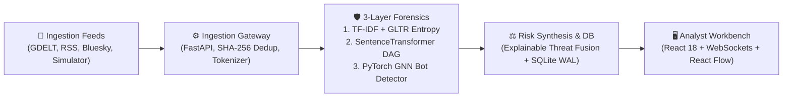
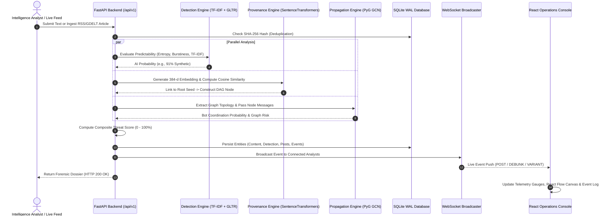

# 05. System Workflow & Architecture Diagrams (Mermaid)

> **Summary:** Clean, horizontal (widescreen-friendly) Mermaid workflow diagrams for **AIShield**. These are optimized for 16:9 presentation slides and Mermaid Live Editor so they fit on a single screen without vertical scrolling.

---

## 1. Widescreen End-to-End System Workflow (`flowchart LR`)

*Optimized horizontally for laptops, projectors, and slides (No vertical scrolling needed).*

```mermaid
flowchart LR
    %% ================= 1. INGESTION =================
    subgraph S1["1. Live Ingestion Feeds"]
        direction TB
        GDELT["GDELT Global News Feed<br/>(100+ Languages)"]
        RSS["BBC & Reuters RSS Feeds"]
        BSKY["Bluesky AT-Protocol"]
        SIM["WebSocket Simulator<br/>(Attacks + Debunks)"]
    end

    %% ================= 2. GATEWAY =================
    subgraph S2["2. Processing Gateway"]
        direction TB
        API["FastAPI Ingestion Gateway"]
        DEDUP["SHA-256 Deduplication"]
        CLEAN["Text Normalizer & Tokenizer"]
        API --> DEDUP --> CLEAN
    end

    %% ================= 3. DEFENSE PIPELINE =================
    subgraph S3["3. Multi-Layer Defense Pipeline"]
        direction TB
        subgraph L1["Layer 1: AI Content Detection"]
            direction TB
            DET["TF-IDF + GLTR Entropy + Watermarks"]
            SCORE1["AI Probability Score (0 - 100%)"]
            DET --> SCORE1
        end

        subgraph L2["Layer 2: Provenance Lineage"]
            direction TB
            EMB["SentenceTransformers MiniLM-L6-v2"]
            DAG["Parent-Child DAG (Cosine >= 0.75)"]
            EMB --> DAG
        end

        subgraph L3["Layer 3: Network & Bot Forensics"]
            direction TB
            GNN["PyTorch Graph Neural Network (GCN)"]
            BOTS["Topological Bot Cluster Score"]
            GNN --> BOTS
        end
    end

    %% ================= 4. RISK & DB =================
    subgraph S4["4. Risk Engine & DB"]
        direction TB
        RISK["Composite Threat Engine<br/>(Explainable Risk Fusion)"]
        DB[("SQLite WAL Database<br/>(Write-Ahead Logging)")]
        RISK --> DB
    end

    %% ================= 5. OPERATIONS CONSOLE =================
    subgraph S5["5. Analyst Operations Console"]
        direction TB
        WS["Live WebSocket Telemetry"]
        UI["React 18 Dark UI Dashboard"]
        FLOW["React Flow Draggable DAG Canvas"]
        LOG["Live Telemetry Log<br/>(Attacks + Debunks)"]
        WS --> UI
        UI --> FLOW
        UI --> LOG
    end

    %% Inter-stage connections
    S1 --> API
    CLEAN --> L1
    CLEAN --> L2
    CLEAN --> L3
    SCORE1 --> RISK
    DAG --> RISK
    BOTS --> RISK
    RISK --> WS
    DB -.-> UI
```



---

## 2. Ultra-Compact Executive Architecture (Single-Line Slide View)

*Use this simplified 5-stage block diagram if you only have 30 seconds on a single slide.*



---

## 3. Request Lifecycle Sequence (Step-by-Step Flow)



---

## 4. Simulation Ecosystem State Diagram

```mermaid
stateDiagram-v2
    [*] --> Idle: Simulator Standby

    state "Scenario Selection" as Select {
        DisinfoThreat: "🚨 Disinfo Threat (Operation GridPulse)"
        VerifiedScience: "🛡️ Verified Science (NASA JWST Outreach)"
    }

    Idle --> Select: Analyst Chooses Scenario

    state "Live Simulation Stream (WebSockets)" as SimStream {
        state DisinfoThreat {
            direction TB
            BotLeak: "60% Adversarial Bot Propagation (Risk: 74% - 98%)"
            FactCheck: "25% Fact-Check Debunks (Risk: 5% - 16%, Emerald Green)"
            OfficialNotice: "15% Institutional Notices (Risk: 10% - 25%, Cyan)"
        }

        state VerifiedScience {
            direction TB
            SciencePost: "85% Verified Scientific Outreach (Risk: 4% - 22%)"
            PublicDiscussion: "15% Organic Citizen Inquiries (Risk: 8% - 28%)"
        }
    }

    Select --> SimStream: Start Simulation

    state "Workbench Metrics Update" as Metrics {
        ExposureGauge: Update Dynamic Reach
        ThreatScore: Update Composite Score (Green <=35%, Amber <=70%, Red >70%)
        EventStream: Render Live Telemetry Chips
    }

    SimStream --> Metrics: Stream Telemetry Events
    Metrics --> Idle: Stop Simulation
```

---

## 5. How to Explain This in Your Viva

When the evaluators ask: *"Explain the architecture / workflow of your project"*, point to the diagram in Section 1:

> *"Our architecture flows from left to right in five clear stages:
> 
> 1. **Ingestion (Left):** We pull real news continuously from GDELT, RSS (BBC/Reuters), and Bluesky, or generate live scenarios in our simulation engine.
> 2. **Gateway:** FastAPI deduplicates content using SHA-256 hashes and normalizes text for analysis.
> 3. **Triple-Layer Forensics (Center):**
>    - *Layer 1 (Linguistic):* Evaluates word predictability with TF-IDF, GLTR entropy, and watermark detection.
>    - *Layer 2 (Provenance):* SentenceTransformers map semantic mutations into a Directed Acyclic Graph (DAG).
>    - *Layer 3 (Network):* A PyTorch Graph Neural Network (GNN) inspects social graph topology to uncover bot rings.
> 4. **Risk & Storage:** All three layers fuse into an explainable composite threat score stored in SQLite WAL mode.
> 5. **Analyst Console (Right):** Telemetry streams live over WebSockets into our React Flow dashboard for human analysts."*
