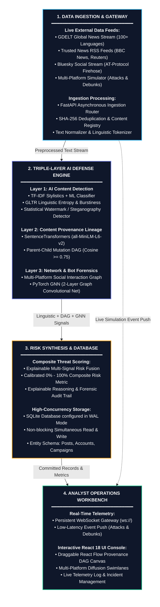
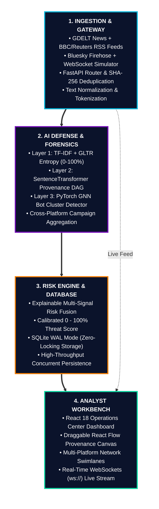
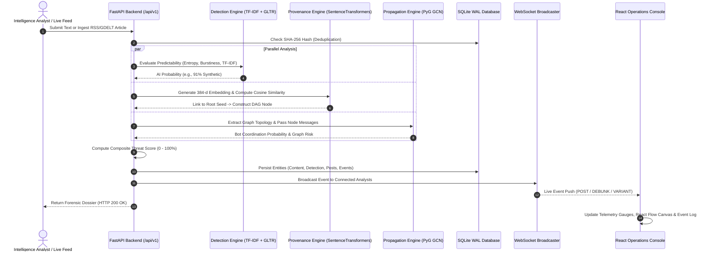

# 05. System Workflow & Architecture Diagrams (Mermaid)

> **Summary:** This file contains visual Mermaid workflow diagrams for **AIShield**, specifically optimized with a **Square-Like (2x2 Balanced Grid)** layout so that it fills **Canva / PowerPoint presentation slides** with large, clear, easily readable text.

---

## 1. Square-Like Presentation Workflow (2x2 Grid — Best for Slides & Canva)

*Optimized aspect ratio (~1.25 : 1) to fill presentation slides completely without wide empty margins or tiny text.*

---

## 2. Minimalist Square 4-Quadrant Architecture (Extra Big Font)

*If you want even larger text with zero clutter on your slide:*

---

## 3. Request Lifecycle Sequence (Step-by-Step Flow)

---

## 4. How to Explain the 2x2 Diagram on Slide 10

When you are on **Slide 10 (Workflow)** in your Canva presentation, point to the 4 quadrants and say:

> *"Our system workflow is organized into four balanced quadrants:
> 
> 1. **Top-Left (Ingestion & Gateway):** We ingest live news from GDELT, RSS feeds, and Bluesky, normalizing and deduplicating data via FastAPI.
> 2. **Top-Right (Triple-Layer AI Defense):** We analyze content across three dimensions: linguistic predictability (TF-IDF + GLTR), mutation ancestry (SentenceTransformer DAG), and bot swarm coordination (PyTorch GNN).
> 3. **Bottom-Left (Risk & Database):** We synthesize all signals into an explainable composite threat score stored in SQLite with Write-Ahead Logging for high concurrency.
> 4. **Bottom-Right (Analyst Operations Workbench):** The intelligence is pushed live over WebSockets to our React 18 dashboard, giving human analysts interactive DAG canvases and diffusion swimlanes."*
